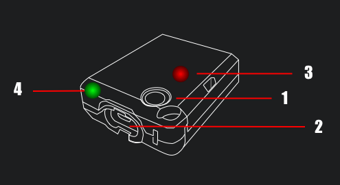

# K Race 使用說明

K Race 是一款能協助汽機車駕駛進行車輛調整的數據監視工具。藉由藍芽連接KOSO Powertry裝置，可以相當有效率的監視車行數據。因為KOSO Powertry裝置內建了相當高效的GPS和陀螺儀模組，而能以相當高頻率的間隔來記錄資料，所以能提供非常精確有效的數值，相較於其他只使用手機GPS資料的App，其數據將準確許多。

在性能測試功能中，可以選擇速度或者距離測試。例如進行0-100時速測試或是400公尺的距離測試。藉由測試可以進一步了解目前車輛的性能和數據，並進一步將這些數據以分段圖表和曲線圖的方式展示，因此駕駛員可以方便地將這些資料相互比較並運用在性能調教上，並觀察其成果，K Race將會是執行效能調校的好工具。

## Powertry

1.  開關：透過長按開關來啟動和關閉Powertry
2. 充電介面：充電介面為micro USB介面
3. GPS訊號燈：當紅燈閃爍時，表示目前為接收到GPS訊號狀態
4. 電量指示燈：當充滿電時，電量指示燈為綠色，當低電量時，電量指示燈為紅色

