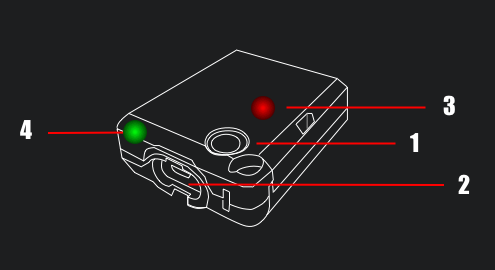
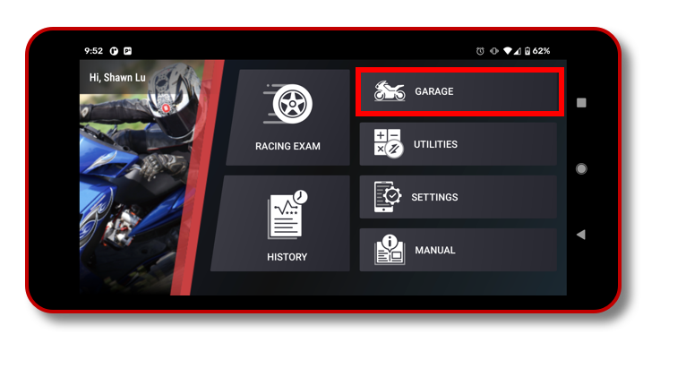
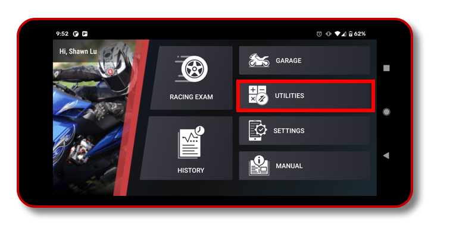
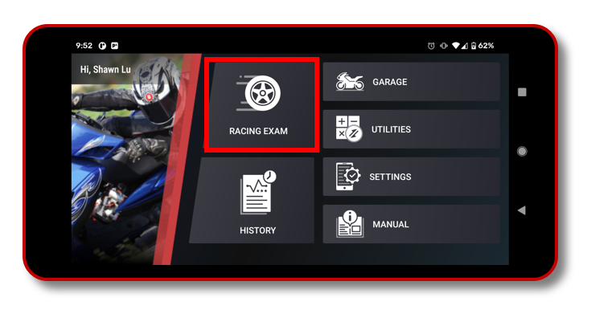
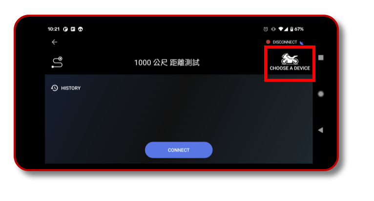
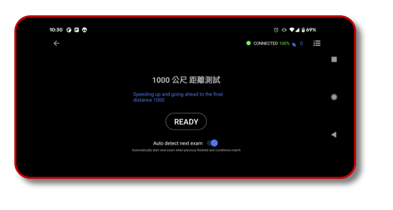
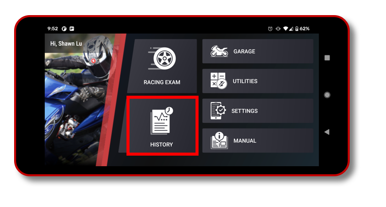

# K Race 使用說明

K Race 是一款能協助汽機車駕駛進行車輛調整的數據監視工具。藉由藍芽連接KOSO Powertry裝置，可以相當有效率的監視車行數據。因為KOSO Powertry裝置內建了相當高效的GPS和陀螺儀模組，而能以相當高頻率的間隔來記錄資料，所以能提供非常精確有效的數值，相較於其他只使用手機GPS資料的App，其數據將準確許多。

在性能測試功能中，可以選擇速度或者距離測試。例如進行0-100時速測試或是400公尺的距離測試。藉由測試可以進一步了解目前車輛的性能和數據，並進一步將這些數據以分段圖表和曲線圖的方式展示，因此駕駛員可以方便地將這些資料相互比較並運用在性能調教上，並觀察其成果，K Race將會是執行效能調校的好工具。

此App設計為賽道使用，請勿在一般道路上使用，並於使用時遵守安全規定。

## Powertry

1.  開關：透過長按開關來啟動和關閉Powertry
2. 充電介面：充電介面為micro USB介面
3. GPS訊號燈：當紅燈閃爍時，表示目前為接收到GPS訊號狀態
4. 電量指示燈：當充滿電時，電量指示燈為綠色，當低電量時，電量指示燈為紅色

## K Race App

1. 車庫

建立與維護車輛訊息，根據車輛數據不同，會影響實測測驗結果，例如輪馬力計算數據推估。車輛數據包含了車輛自訂名稱、車輛品牌、車輛型號、車輛排氣量(cc數)、總重量(車重+駕駛人重量)。

2. 應用程式

K Race 提供了數個效能計算機，包含馬力輸出計算機、排氣量計算機、齒輪比計算機、性能表現計算機。透過這些工具可以協助駕駛人或車輛工程師，在性能調教時提供有用的參考數據。

3. 性能測試

在性能測試當中，分成速度和距離測試項目，例如0-100km/h的加速度測試、50-0km/h的減速度測試以及1000公尺距離測試等。依需求使用者可以自己建立所需要的測試項目。

選擇了測試項目之後，選擇連接KOSO POWERTRY裝置，名稱為KOSO_XXXT114D，透過藍芽連結裝置。因此需要開啟藍芽連線服務，以及位置服務，藍芽連線需啟用位置服務，否則會找不到裝置。

連線後，在戶外空曠處靜待Powertry完成GPS訊號定位，此時K Race會提示目前的測試項目，並展示READY按鈕，下方可以選擇啟用或關閉自動偵測下一趟測試。

- 啟用自動下一趟測試時，當結束一趟測試後回到初始狀態，例如速度歸零後，即可以繼續下一趟測試，不需要任何操作。
- 關閉自動下一趟測試時，當結束一趟測試後會回到READY畫面，按下READY來開始下一趟測試。

4. 歷史紀錄

 歷史紀錄提供了過去測試過的所有紀錄，提供了速度、距離資料分段的分析表，並可以以曲線圖的方式展示最多三筆資料的比較，用以作為數據分析和性能調教的參考。

