# K Race 使用說明

K Race 是一款能協助汽機車駕駛進行車輛調整的數據監視工具。藉由藍牙連接KOSO Powertry裝置，可以相當有效率的監視行車數據。因為KOSO Powertry裝置內建了相當高效的GPS和陀螺儀模組，而能以相當高頻率的間隔來記錄資料，所以能提供非常精確有效的數值，相較於其他只使用手機GPS資料的App，其數據將準確許多。

在性能測試功能中，可以選擇速度或者距離測試。例如進行0-100時速測試或是400公尺的距離測試。藉由測試可以進一步了解目前車輛的性能和數據，並進一步將這些數據以分段圖表和曲線圖的方式展示，因此駕駛員可以方便地將這些資料相互比較並運用在性能調教上，並觀察其成果，K Race將會是執行效能調校的好工具。

此App設計為賽道使用，請勿在一般道路上使用，並於使用時遵守安全規定。

## 硬體設備

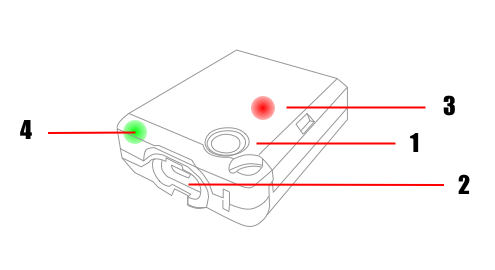

1.  開關：透過長按開關來啟動和關閉Powertry
2. 充電介面：充電介面為micro USB介面
3. GPS訊號燈：當紅燈閃爍時，表示目前為接收到GPS訊號狀態
4. 電量指示燈：當充滿電時，電量指示燈為綠色，當低電量時，電量指示燈為紅色

## K Race App

### 車庫

建立與維護車輛訊息，根據車輛數據不同，會影響實測測驗結果，例如輪馬力計算數據推估。車輛數據包含了車輛自訂名稱、車輛品牌、車輛型號、車輛排氣量(cc數)、總重量(車重+駕駛人重量)。

### 應用程式

K Race 提供了數個效能計算機，包含馬力輸出計算機、排氣量計算機、齒輪比計算機、性能表現計算機。透過這些工具可以協助駕駛人或車輛工程師，在性能調教時提供有用的參考數據。

### 性能測試

在性能測試當中，分成速度和距離測試項目，例如0-100km/h的加速度測試、50-0km/h的減速度測試以及1000公尺距離測試等。依需求使用者可以自己建立所需要的測試項目。

選擇了測試項目之後，選擇連接KOSO POWERTRY裝置，名稱為KOSO_XXXXXXXX（後方碼各自不同），透過藍芽連結裝置。因此需要開啟藍芽連線服務，以及位置服務，藍芽連線需啟用位置服務，否則會找不到裝置。

連線後，在戶外空曠處靜待Powertry完成GPS訊號定位，此時K Race會提示目前的測試項目，並展示READY按鈕，下方可以選擇啟用或關閉自動偵測下一趟測試。

- 啟用自動下一趟測試時，當結束一趟測試後回到初始狀態，例如速度歸零後，即可以繼續下一趟測試，不需要任何操作。
- 關閉自動下一趟測試時，當結束一趟測試後會回到READY畫面，按下READY來開始下一趟測試。

### 歷史紀錄

 歷史紀錄提供了過去測試過的所有紀錄，提供了速度、距離資料分段的分析表，並可以以曲線圖的方式展示最多三筆資料的比較，用以作為數據分析和性能調教的參考。

## 開始您的第一次性能測試

### 建立車輛

建立您的第一輛車，並填入基本資料，排氣量和重量將會運用在輪馬力的估計運算當中，車輛的名稱則用於歷史資料篩選排序之用。

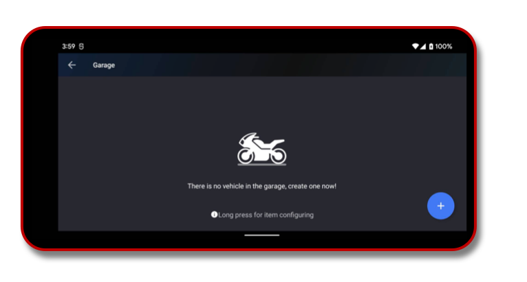

### 建立一個100公尺性能測試

您可以建立一個預設的測驗項目，或是建立一個自己專用的測驗項目。按下畫面右方的+按鈕，來新增一個100公尺性能測試。

選擇速度區間測試或者距離測試

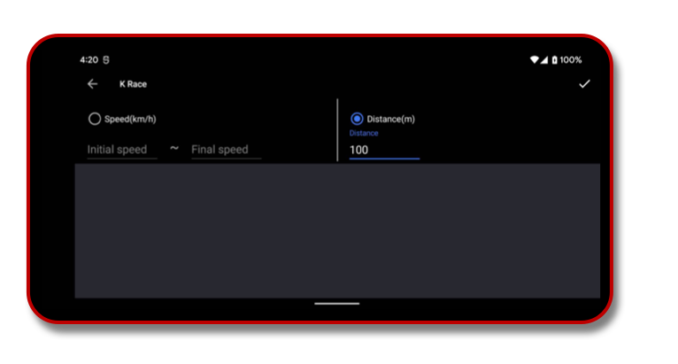

選擇我們剛建立好的模式，開始進行測驗

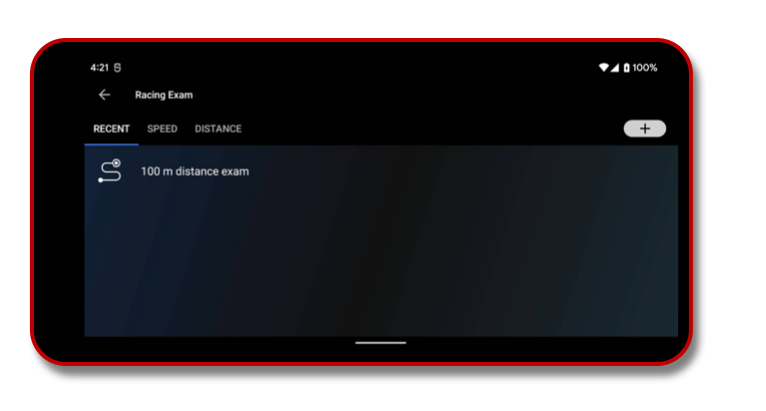

### 連線到Powertry 設備

按下右側選擇連線裝置，會搜尋附近的POWERTRY裝置，選擇裝置後開始連線

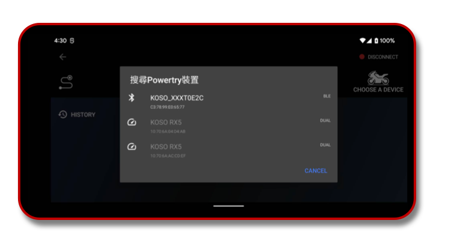

連上後畫面顯示目前裝置狀態，等到裝置訊號穩定時，會自動進入下個畫面

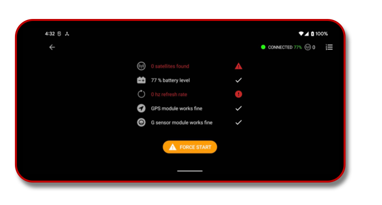

自動偵測下個測驗開關可以讓測試者不需操作手機按下READY，即可重複進行測試。若選擇關閉自動偵測下一趟，則完成一次測試會回到這個畫面，需按下READY以繼續下移輪測驗。

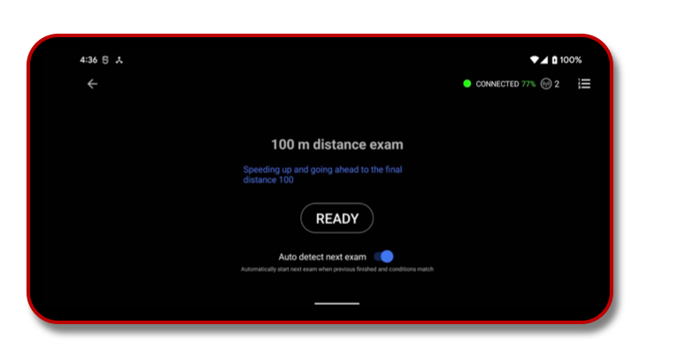

### 開始測驗

開始測試時，距離測試分為三個階段，首先需靜止等待出現 Ready to go 時，可以開始催動油門前進

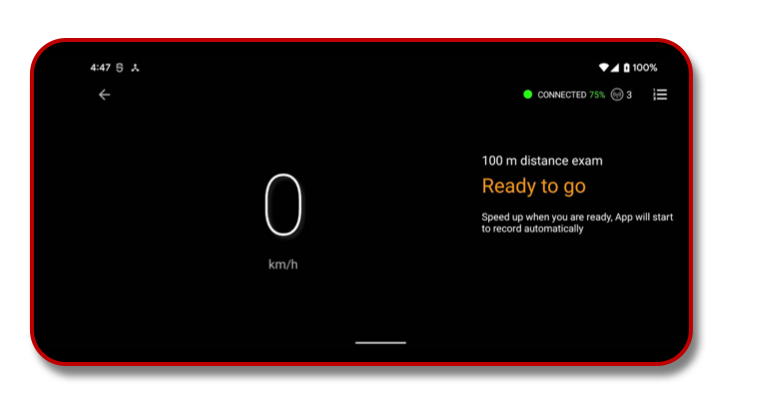

啟動後App自動偵測到車輛移動開始記錄數據，持續前進直到目標距離(在這個例子為100公尺)，此階段為Recording

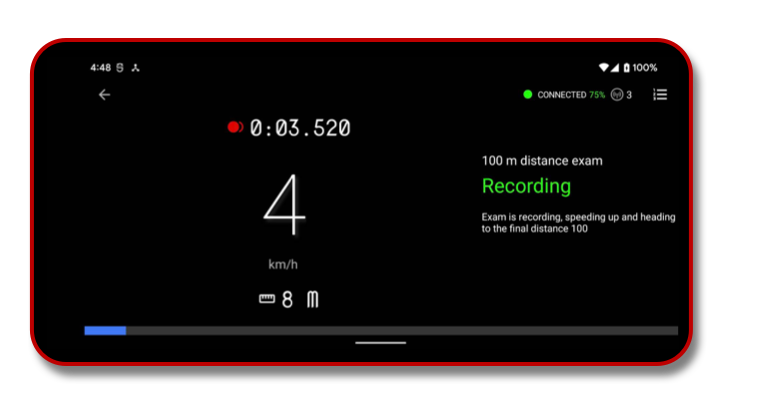

到了目標距離後，App會紀錄該次測試結果，此階段為Initialing，等待靜止後回到 Ready to go ，得以進行下一輪測試

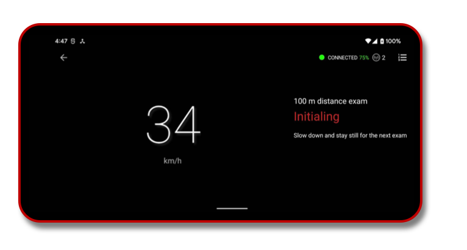

### 檢視結果

結速性能測驗後，可以在歷史資料處找到過去的測試結果

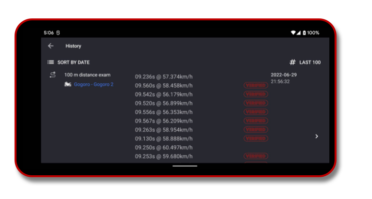

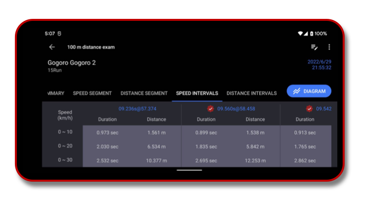

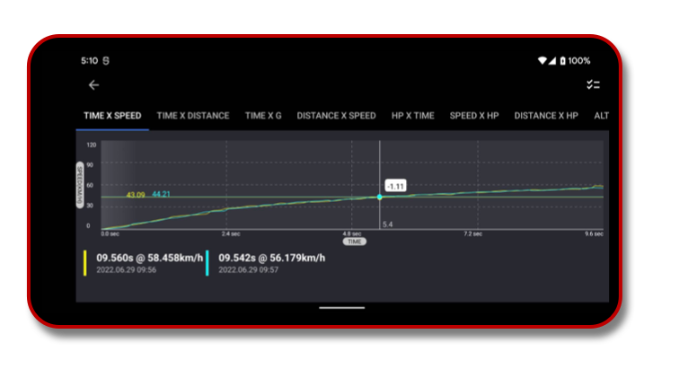