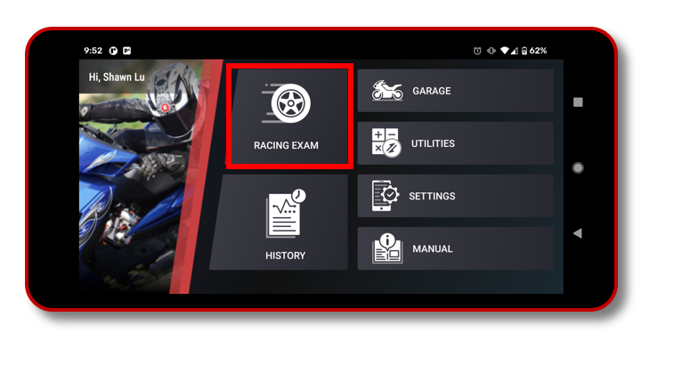
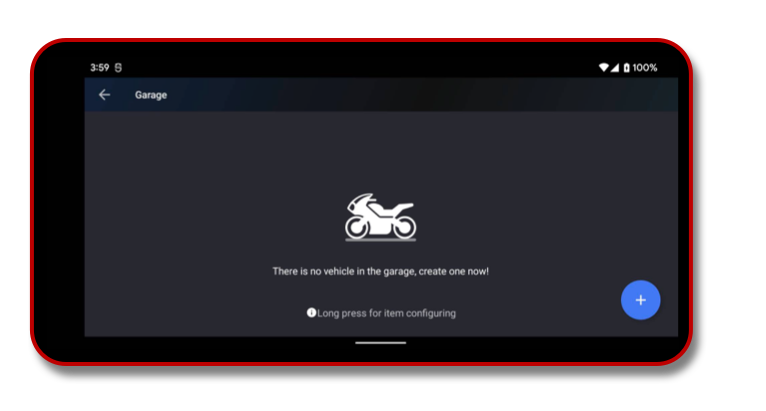
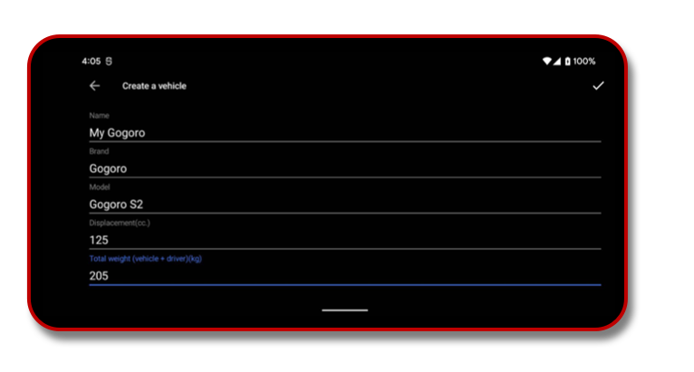
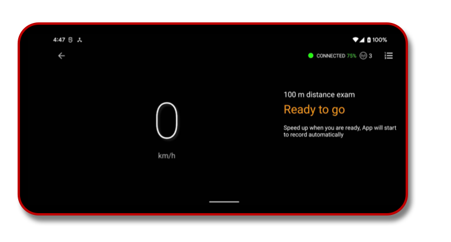
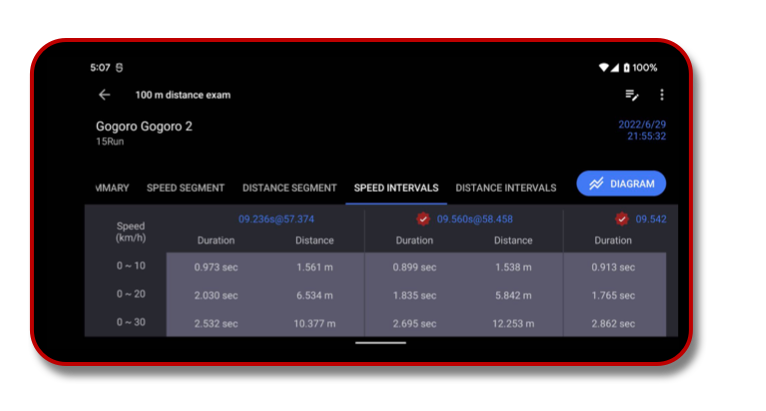

Translated by Google

# K Race 紹介

**★  このアプリは競馬場で使用するように設計されています。一般の道路や通りでは使用しないでください。安全規則に従うように注意してください。**

K Raceは、モーターと車のドライバーが車両のパフォーマンスを調整するのを支援するデータ監視ツールです。Bluetooth経由でKOSO Powertryデバイスに接続すると、運転データを効率的に監視できます。KOSO Powertryデバイスには、高効率のGPSおよびジャイロスコープモジュールが組み込まれており、比較的高い周波数間隔でデータを記録できるため、非常に正確で効果的な値を提供できます。携帯電話のGPSデータのみを使用する他のアプリと比較して、そのデータははるかに正確になります。
性能試験機能では、速度試験または距離試験を選択できます。たとえば、0〜100の速度テストまたは400メートルの距離テスト。テストを通じて、現在の車両の性能とデータをさらに理解し、データをセグメント化されたチャートやグラフの形式でさらに表示できるため、ドライバーはこれらのデータを簡単に比較してパフォーマンスチューニングに使用できます。 、およびそのパフォーマンスを観察します。結果として、Kレースはパフォーマンスチューニングを実行するための優れたツールになります。
Kレースでは、0-100スピード試験や400メートルの距離試験などの距離とスピードの試験があります。これらの試験を通じて、これらの結果データはデータテーブルおよびトレンドグラフとして提示できます。ユーザーは、これらのデータを簡単に比較してパフォーマンスチューニングに使用し、パフォーマンスを観察できます。結果として、Kレースはパフォーマンスチューニングのための素晴らしいツールになります。

## Powertry ハードウェア 

1. 電源オン：ボタンを長押しして電源をオンにします
2. 充電インターフェース：Powertryには充電用のマイクロUSBがあり
    ます
3.  GPS信号：GPSが利用可能な場合は赤いライトが点滅します
4. バッテリーレベル：バッテリーがフル充電されている場合、ライトが低い場合、ライトは緑色になります。ライトが赤くなります

## App

### Garage

ガレージでは、名前、モデル、重量、排気量などの詳細を含むさまざまな車両を確立できます。このメタデータは、パフォーマンスの比較と分析に使用できます。

### Utilities

ユーティリティ機能では、馬力計算機、排気量計算機、ギアレート計算機、パフォーマンス計算機、理論速度が提供され、パフォーマンス調整時に関連データを計算できます。

### Racing exam

試験の2種類は、スピードと距離ですレース試験機能に含まれています。いくつかのテストでは、0 - 1000メートルの加速や0 - 100キロ/ hのような場合は、適切なビルドの試験で利用可能な場合は、ユーザーがカスタマイズの試験速度や距離条件に基づいて追加することができます。

プロジェクトを選択すると、ユーザーはbluetoothを介してPOWERTRYに接続できます。 この場合、権限要求は許可を求めるプロンプトを表示することがあります。 bluetooth通信には青歯と精密位置決め権限が必要です。

### History

履歴機能では、すべてのレコードがここにあり、日付、車両、または条件ごとに一覧表示できます。ここで、ユーザーはセグメント化されたテーブルまたはトレンドチャートによってすべてのデータを確認できます。  

## 最初の試験を開始します

### 車両を作成する

ガレージに利用可能な車両がない場合、試験を開始するための最初のステップは、それを作成することです。重量と変位のデータはホイールハウスパワーの計算に使用され、車両の名前は履歴データのフィルタリングと並べ替えに使用されます。

### 100メートルの試験を作成する

事前設定された試験を選択するか、適切な試験がない場合はカスタマイズされた試験を作成できます。画面右側の+ボタンを押して、100mのパフォーマンステストを追加します。

試験を開始するために作成した試験を選択してください

### Powertryに接続する

画面右側の「デバイスを選択」ボタンを押して、近くの電源をスキャンします。

11を超える衛星信号ゲイン、10％のバッテリーレベル、14hzのリフレッシュレート、GPS、加速度センサーモジュールなど、Powertryのステータスがより安定するのを待つことは正常に機能します。

「次の検査の自動検出」スイッチボタンを使用すると、画面に触れることなく、完了後に次の実行を自動開始できます。スイッチがオフの場合は、準備を押して次の試験を手動で開始する必要があります。

### 試験開始

試験に入るとき、試験モードには3つのフェーズがあり、最初は「Ready to go」です。「Ready to go」で移動を開始できるようになると、アプリは移動を確認し、次のフェーズの「記録」に変更します

「Recording」フェーズでは、アプリは、定義された条件（この場合は100メートル）に到達した後、試験中にデータを記録し続けます

この試験で定義された条件に達すると、アプリはレコードを生成し、速度を待って初期条件に戻ります。このフェーズは「初期化」です。速度が0に戻った後、フェーズは「準備完了」になります。

### レビューを記録する

試験を完了すると、履歴から自分の記録を見つけることができます。

ソートオプションを変更して、決定試験を検索およびチェックアウトすることができます。

詳細データセグメントを確認し、DIAGRAMボタンを押してトレンドチャートを確認します。

